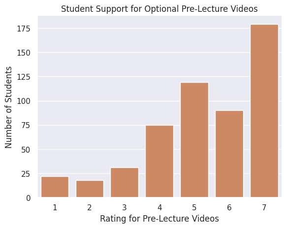
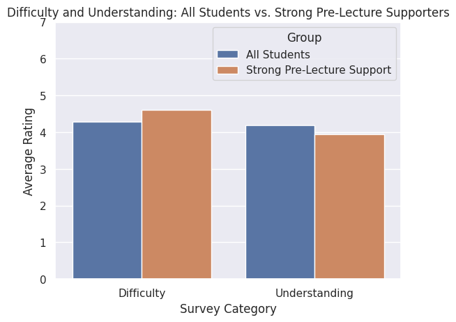
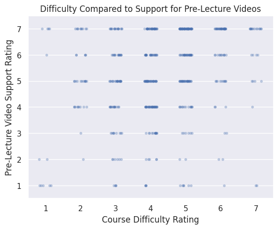

---
# Do not edit the text between these lines!
layout: default
---

# Improving COMP110 with Optional Pre-Lecture Videos by Aaditya and Spencer!
## Analysis Idea: 
This project analyzes COMP110 student survey data to evaluate whether optional short pre-lecture videos would create value for students. Using custom Python data utility functions and visualizations, the analysis explores overall student support, relationships between course difficulty and video demand, and whether students who need additional support are more likely to benefit from pre-lecture resources.

## Why we chose this? 
This idea is the strongest idea to analyze because the survey directly includes a column called `pre_lecture_videos` which asks students whether optional pre-lecture videos would be helpful for their learning. It can also be connected to other useful columns like `difficulty`, `understanding`, `ls_effective`, and `would_recommend` to see whether students who are struggling more would benefit from extra preparation before lecture. This idea is valuable because it is a realistic and simple course improvement that could support many students without completely changing the structure of the course.

# Analysis
## Step 1
We are starting by loading the survey data and importing my utility functions. Our main idea is that COMP110 should add optional short pre-lecture videos before each major topic. I want to see whether students generally support this idea and whether students who find the course difficult may especially benefit from it.

Our code:
from data_utils import read_csv_rows, head, select, count, concat, columnar
from data_utils import filter_greater_than, average_rating

## Step 2
First, I am loading the survey CSV file using `read_csv_rows`. This turns the CSV into a list of dictionaries, where each dictionary represents one student's survey response. Then, I am using `head` to preview the first five rows and make sure the data loaded correctly.

Our code: 
survey_data: list[dict[str, str]] = read_csv_rows("/workspaces/COMP110 New/comp110-26s-workspace/exercises/ex09/data/survey_izzi.csv")
head(survey_data, 5)

## Step 3
Initially, we want to find the average student rating for optional pre-lecture videos. Since this column uses a 1 to 7 scale, a higher average would suggest stronger student support for adding pre-lecture videos to the course.

Our code: 
pre_lecture_average: float = average_rating(survey_data, "pre_lecture_videos")
pre_lecture_average

## Step 4
Next, I want to filter the data to only include students who gave strong support for optional pre-lecture videos. We am treating ratings greater than 5 as strong support because these responses are above the middle of the 1 to 7 scale.

Our code: 
strong_support_rows: list[dict[str, str]] = filter_greater_than(survey_data, "pre_lecture_videos", 5)
support_over5 = count(strong_support_rows)
total_responses = count(survey_data)
avg = (support_over5 / total_responses) * 100
print(f'Exactly {avg:.2f}% of students strongly support pre-lecture videos!')
 
Result: Exactly 50.37% of students strongly support pre-lecture videos!

## Step 5
Now, I am using `columnar` to transform the data from row-based form into column-based form. This is useful because it lets me view each survey question as a full list of responses. I am checking the available column names to confirm that the columns I need for my analysis exist. Them, I am now using `select` to pull out only the `pre_lecture_videos` column. This column is important because it directly measures whether students believe optional pre-lecture videos would be helpful for their learning.

Our code: 
survey_columns: dict[str, list[str]] = columnar(survey_data)
survey_columns.keys()
pre_lecture_values: list[str] = select(survey_data, "pre_lecture_videos")
head_list: list[str] = pre_lecture_values[:10]
head_list

## Step 6
Now, we want to compare the average difficulty rating for all students with the average difficulty rating for students who strongly support pre-lecture videos. This can help us understand whether students who want pre-lecture videos also tend to find the course more difficult.

Our Code: 
overall_difficulty_average: float = average_rating(survey_data, "difficulty")
strong_support_difficulty_average: float = average_rating(strong_support_rows, "difficulty")
print(f"Average difficulty for all students: {overall_difficulty_average:.2f}")
print(f"Average difficulty for students who strongly support pre-lecture videos: {strong_support_difficulty_average:.2f}")

Code Result: 
Average difficulty for all students: 4.29
Average difficulty for students who strongly support pre-lecture videos: 4.60

## Step 7
We also want to compare understanding of the course material amongst students. If students who strongly support pre-lecture videos have lower understanding ratings, that could suggest pre-lecture videos may help students who feel less confident with the material.

Our Code: 
overall_understanding_average: float = average_rating(survey_data, "understanding")
strong_support_understanding_average: float = average_rating(strong_support_rows, "understanding")
print("Average understanding for all students:", overall_understanding_average)
print("Average understanding for students who strongly support pre-lecture videos:", strong_support_understanding_average)

Code Result: 
Average understanding for all students: 4.198501872659176
Average understanding for students who strongly support pre-lecture videos: 3.9516728624535316

As we found above with difficulty, students who support pre-lecture videos have lower overall understanding compared to the population mean and also find the course material more difficult. This suggests a positive association between support for pre-lecture videos and students who need additional help understanding the course material.

## Step 8 
We am also using `concat` to combine two related lists of responses: support for pre-lecture videos and support for livestreamed lectures. Both columns relate to adding more flexible learning resources outside of normal in-person lecture. This helps me look at whether students generally support extra learning options beyond the current course structure. We chose to slice and show the first 10 values of the list instead of displaying the entire combined list.

Our Code: 
pre_lecture_support: list[str] = select(survey_data, "pre_lecture_videos")
livestream_support: list[str] = select(survey_data, "add_livestream")
combined_flexible_learning_support: list[str] = concat(
    pre_lecture_support, livestream_support
)
combined_flexible_learning_support[:10]

# Data Visualizations

## Visualization 1
For my first visualization, I am creating a count plot showing how students rated optional pre-lecture videos. This helps show whether most students disagree, feel neutral, or agree that pre-lecture videos would be helpful.

## Visualization 2
For my second visualization, I am comparing the average difficulty and understanding ratings for all students versus students who strongly support pre-lecture videos. This helps me see whether the students who want pre-lecture videos are also students who may need more support with the course material.

## Visualization 3
For my third visualization, I am making a scatterplot comparing students' difficulty ratings with their support for pre-lecture videos. This can help show whether students who find the course more difficult also tend to support pre-lecture videos more.

This visualization shows a positive association between course difficulty and support for pre-lecture videos. Students who rate COMP110 as more difficult are more frequently concentrated at support ratings of 6 and 7, showing that students who struggle more tend to want additional learning resources. This suggests optional pre-recorded lectures could be especially valuable for students who need extra support before class.

# Conclusion
Based on our analysis, the data supports the idea that COMP110 should add optional short pre-lecture videos before major topics. The strongest evidence is that many students rated support for pre-lecture videos highly with the largest group of students selecting 7. This data suggests that there is broad student interest in having an additional resource before lecture. The analysis also showed that students who strongly support pre-lecture videos reported a higher average difficulty rating than the overall population with the overall difficulty average being 4.29 and the strong-support group average being 4.60. In addition, students who strongly support pre-lecture videos had a lower average understanding rating than the overall population which suggests that the students most interested in this resource may also be students who feel less confident with the course material.

However, there are some trade-offs to consider such as the fact that creating pre-lecture videos would require extra time from instructional staff, especially if the videos need to be clear, short, accessible, and updated when course content changes. There is also a slight risk that some students may treat the videos as a replacement for lecture instead of a preparation tool. Another downside is that too many extra resources could overwhelm students if they feel like they have even more work to complete before class so it should be specified that they are optional but helpful resources.

One possible refinement would be to make the videos optional, short, and focused only on the most difficult topics, such as memory diagrams, objects, recursion, and linked lists. In the future, the course could collect more specific data by asking students which topics they would want pre-lecture videos for and whether they actually watched them. The course could also compare quiz or assignment performance before and after adding these videos to see whether they improve learning outcomes.
